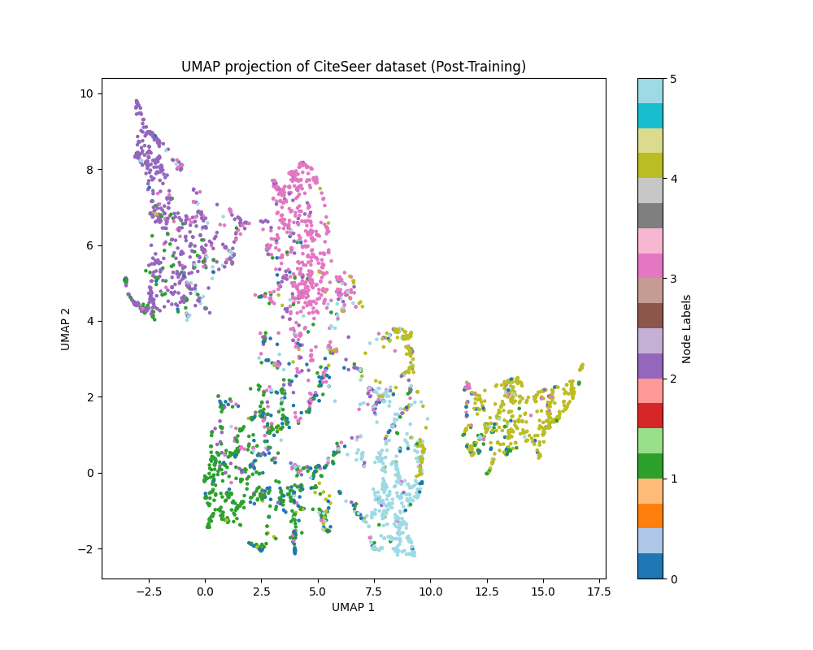
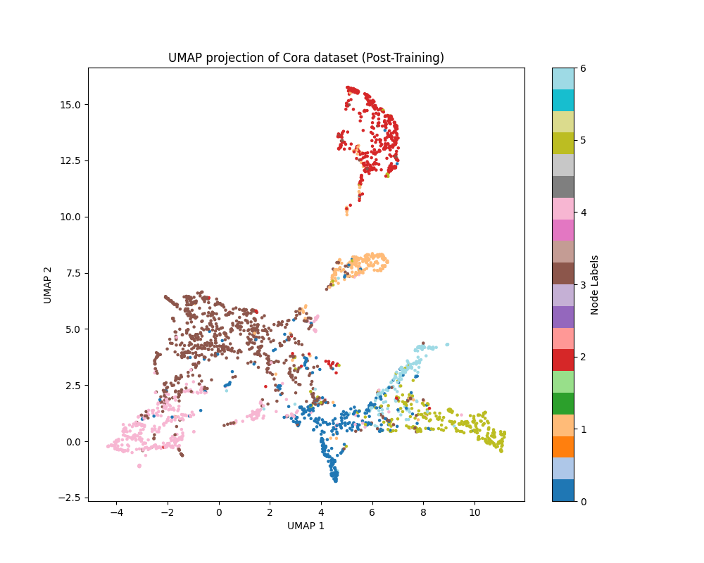

## Introduction

Graph Attention Networks (GAT) leverage attention mechanisms to learn the importance of neighboring nodes in a graph. This implementation supports both transductive and inductive learning settings.

## Installation

To install the required dependencies, run:

```sh
pip install -r requirements.txt
```

## Usage

To train the GAT model on a specific dataset, run:

```sh
python GAT/Main.py --dataset <DATASET_NAME>
```

Replace `<DATASET_NAME>` with one of the following options: `Cora`, `CiteSeer`, `Pubmed`, `PPI`.

## Datasets

The supported datasets are:
- **Cora**: Citation network dataset for node classification.
- **CiteSeer**: Citation network dataset for node classification.
- **Pubmed**: Citation network dataset for node classification.
- **PPI**: Protein-Protein Interaction dataset for multi-class node classification.

## Training

The training process varies based on the dataset:
- For transductive learning (e.g., Cora, CiteSeer, Pubmed), the model is trained on the entire graph.
- For inductive learning (e.g., PPI), the model is trained using mini-batch training.

## Evaluation

The evaluation metrics include accuracy for transductive learning and F1-score for inductive learning. The evaluation scripts are included in the `Train.py` file.

## Visualization

The repository includes scripts to visualize the learned node embeddings using UMAP. These visualizations help in understanding the clustering and separation of different node classes after training.

To visualize the embeddings, run the `umapplot.py` script:

```sh
python GAT/umapplot.py
```

### Here is an example of the learned model emb  visualization for the CiteSeer dataset:

### Here is an example of the learned model emb visualization for the Cora dataset:



### If you like this implementation, please give it a star on GitHub!

## License

This project is licensed under the MIT License. See the [LICENSE](LICENSE) file for details.
